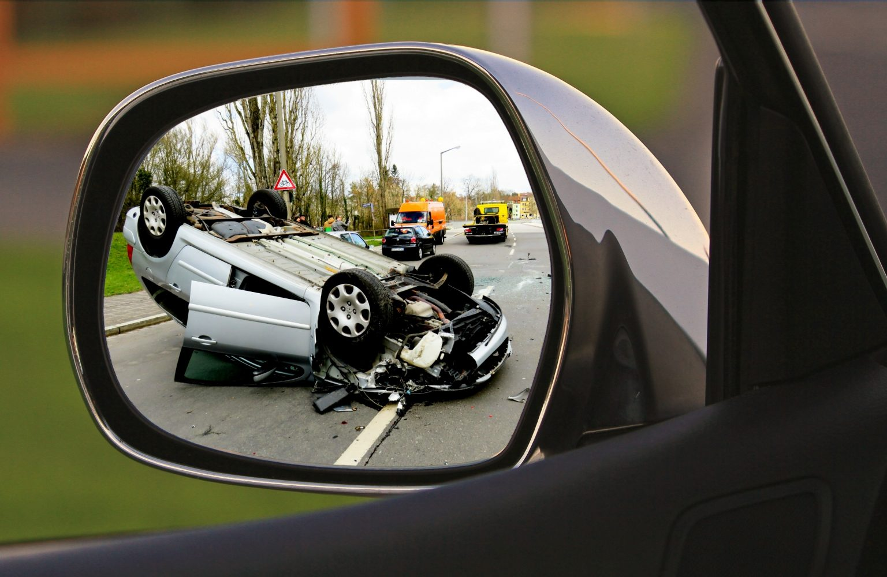
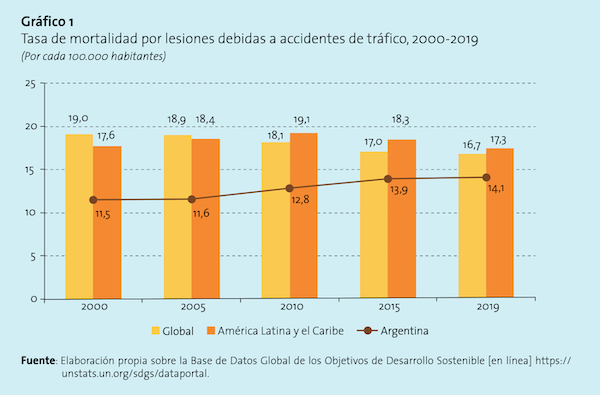

  

# <h1 align=center>Proyecto Individual Nº 2 - Data Analytics</h1>

  

Desarrollado por Ana Paulina Maya Cohorte 18

# <h2 align=left>Rol a desarrollar</h2>

El desafío planteado para este proyecto consiste en asumir un rol de Data Analyst y llevar a cabo un análisis completo de los datos recibidos sobre la mortalidad en siniestros viales en la ciudad de Buenos Aires. Tendremos que analizar y presentar la información de tal manera que permita visualizar tendencias y tomar decisiones informadas sobre las medidas que pueden y deben adoptarse, a futuro, para la prevención de accidentes y la disminución en perdidas de vidas por esta causa.

El trabajo se compone, por un lado, de un Análisis Exploratorio de Datos en Python en el cual se busca conocer acerca de las características y evolución del sector en los últimos años; y se complementa con un Dashboard interactivo en Tableau, en el cual se incluyen ciertos indicadores claves de rendimiento del sector (KPI).

# <h1 align=center>Análisis de siniestros viales en la Ciudad Autónoma de Buenos Aires, Argentina</h1>

  

 <h2 align=left>Contexto</h2>

Los países de América Latina registran casi el doble de accidentes en carretera que los europeos. Según datos recientes de la ONU, los países de la región registraron 17 muertes por cada 100.000 habitantes por este motivo, casi dos veces más que el promedio europeo de nueve personas, además son una de las principales causas de mortalidad infantil y juvenil. Agunos datos que dan muestra de esto son:
- Cada año, las colisiones causadas por el tránsito se cobran la vida de aproximadamente 1,19 millones de personas.
- Según el Banco Mundial, los peatones representan casi el 50% de las víctimas mortales en las carreteras de El Salvador.
- En 2022, los accidentes de tráfico fueron la segunda causa de muertes violentas en Honduras.
- En Brasil, los conductores de vehículos motorizados de dos y tres ruedas son los que corren más riesgos en las carreteras del país.
- Según el Banco Mundial, los accidentes de tráfico son la principal causa de muerte entre las personas de cinco a 29 años en Paraguay, y las lesiones causadas por éstos han aumentado en los últimos cinco años.
- Los usuarios vulnerables de las vías, como los peatones y ciclistas, son los que corren mayor riesgo, y junto con los motociclistas representan más de la mitad de las muertes en las redes viales del mundo cada año.

Además de ser una tragedia humana, los accidentes de tráfico mantienen a los países en un círculo vicioso de pobreza. Según el Banco Mundial, el coste de estos accidentes representa el 7,5% del PIB en Paraguay, el 5,5% en Honduras, el 6,6% en Brasil y el 7,4% en El Salvador.  He aquí una razón más para replantearse la movilidad e invertir en seguridad vial, señala la Comisión Económica de la ONU para Europa (CEPE).

"Esto significa que cientos de millones de dólares no están a disposición de los países para invertir en infraestructuras como hospitales y sistemas de salud pública, escuelas y universidades, agua y saneamiento, energía o vivienda; sin mencionar la creación de empleo, la protección del medio ambiente y la acción por el clima"

Argentina no es un país ajeno a esta problemática, en el período 2000-2019, la tasa de mortalidad por lesiones provocadas por accidentes de tránsito a nivel mundial, regional y para la Argentina han sido heterogéneas (véase el gráfico 1). Mientras que la tasa mundial ha observado una tendencia decreciente, al pasar de 19,0 a 16,7 personas por accidentes de tráfico por cada 100.000 habitantes entre el 2000 y 2019, en América Latina y el Caribe la reducción comenzó solo a partir de 2010. Por el contrario, la Argentina ha mostrado un persistente incremento. La tasa de mortalidad en este país aumentó de 11,4 a 14,1 personas entre 2000 y 2019.

  

# <h3 align=left>Observatorio de Movilidad y Seguridad Vial - OMSV</h> #

El Observatorio de Movilidad y Seguridad Vial (OMSV), centro de estudios que se encuentra bajo la órbita de la Secretaría de Transporte del Gobierno de la Ciudad Autónoma de Buenos Aires, es un centro de estudios de alta eficiencia y nivel técnico que fue creado con el objetivo de sistematizar y analizar información para comprender la situación actual en materia de seguridad vial en la Ciudad. Desde 2020 se amplió su campo de acción, incluyendo la elaboración de informes y reportes relativos a la Movilidad en la Ciudad.

El OMSV nos solicita la elaboración de un proyecto de anális de datos, con el fin de generar información que le permita a las autoridades locales tomar medidas para disminuir la cantidad de víctimas fatales de los siniestros viales. Para ello, nos disponibilizan un dataset sobre homicidios en siniestros viales acaecidos en la Ciudad de Buenos Aires durante el periodo 2016-2021.

 <h2 align=left>Datos</h2>

Se nos pide trabajar con una base de datos que contiene información de Víctimas Fatales en Siniestros Viales y que se encuentra en formato de Excel (Homicidios.xslx). El archivo contiene dos pestañas de datos:

- HECHOS: que contiene una fila por cada accidente (hecho) con id único y las variables temporales, espaciales y participantes asociadas al mismo.
- VICTIMAS: contiene una fila por cada víctima de los hechos y las variables edad, sexo y modo de desplazamiento asociadas a cada víctima.

En el documento se encuentran otras dos pestañan en las que se detallan todas las definiciones manejadas en los datos y en el desarrollo de este proyecto. La base de datos fue descargada de [este enlace](https://data.buenosaires.gob.ar/dataset/victimas-siniestros-viales) y además puede encontrarse en este repositorio, en la carpeta [Datos Fuente](https://github.com/anapmaya/PI02_HENRY_DA/tree/main/datos%20fuente)

Además, para cumplir con los KPI's solicitados, eran necesario conocer la población de la Ciudad de Buenos Aires en los años para los cuales existen datos en la base de datos (2016 - 2021).
Estos los obtuve de [este enlace en la página web del Censo 2022 República Argentina](https://censo.gob.ar/wp-content/uploads/2023/11/c2022_caba_est_c1_1.xlsx)

 <h2 align=left>Desarrollo del proyecto</h2>

 <h3 align=left>ETL</h3> 

 #

En primer lugar se tomó el archivo homicidios.xslx y se realizó un proceso de ETL, extrayendo y disponiendo la información contenida en ambas pestañas, en dataframes diferentes. Para cada dataframe se hizo un proceso de revisión y manejo de datos nulos, identificacion de duplicados, elección y unificación de tipos de datos, eliminación de algunas columnas. Se realizaron algunas transformaciones para intentar complementar los vacíos que existían y dejar toda la data en las mejores condiciones para ser analizada en el EDA y presentada en el Dashobard. Ambos dataframes se combinaron en uno completo, que fue exportado a formato CSV. El proceso completo y documentado se encuentra en el archivo [ETL](https://github.com/anapmaya/PI02_HENRY_DA/blob/main/jupyter%20notebooks/ETL.ipynb), dentro de la carpeta [Jupyter Notebooks](https://github.com/anapmaya/PI02_HENRY_DA/tree/main/jupyter%20notebooks).

 <h3 align=left>EDA</h3> 

 #

A continuación se realizó un proceso de EDA, visualización y gráficas de relaciones entre variables para empezar a entender el comportamiento del fenómeno. Todo está documentado y comentado en el archivo [EDA](https://github.com/anapmaya/PI02_HENRY_DA/tree/main/jupyter%20notebooks), dentro de la carpeta [Jupyter Notebooks](https://github.com/anapmaya/PI02_HENRY_DA/tree/main/jupyter%20notebooks).

Se realizaron observaciones según las dimensiones demográficas (edad, sexo), espaciales (comuna, tipo de vía) y temporales (año, mes, hora del día) de los datos disponibles. También se tuvieron en cuenta el tipo de vehículo, los actores involucrados en el accidente y el rol de las víctimas. Los análisis realizados fueron muy globales, tomando en casi todos los casos el total de datos sumados para todos los años del rango analizado.

Algunas conclusiones obtenidas de este analisis fueron:
- Entre los años 2016, 2017 y 2018, las variaciones entre la cantidad de víctimas no fueron muy representativas, sin embargo se presentaron disminuciones importantes en los años 2019 y 2020. Desafortunadamete estas vuelven a aumentar en el 2021.
- Una tendencia que se ve presente en todos los años es la marcada diferencia entre la cantidad de mujeres y hombres que mueren en accidentes viales, siende esto siempre mayoría.
- Los picos de mayor cantidad de muertes a lo largo del año varían cuando analizamos año a año, lo que no nos permite establecer un patrón o afirmar que existe uno o varios meses en el año en los que constantemente se dan más accidentes viales con resultados fatales.
- Quienes se encuentran más vulnerables en este tipo de accidente son los peatones y los motociclistas.
- El momento del día en qué más accidentes fatales se presentan es entre las 5 y las 7AM.
- La mayor peligrosidad de las avenidas queda de manifiesto al comparar cantidades de vícitmas según el típo de vía en que ocurrió el accidente.
- Las comunas 1, 4 y 9 son en las que se han presentado más siniestos con desenalce fatal.

 Los análisis más detallados y filtrdos será más fácil realizarlos en el dashboard.

#  <h3 align=left>Dashboard Interactivo en Tableau</h3> 

#  <h3 align=left>Indicadores clave de Desempeño - KPIs</h3> 

#  <h2 align=left>Indice de archivos del repositorio</h2> 

1. Carpeta Datasets: Contiene los datasets generados después del proceso de ETL, con los cuales se realizó el proceso de EDA, se llevaron a Tabelau para graficar y analizar y se calcularon los KPI's.
    - [Dataset con el contenido limpio de la pestaña Hechos de homicidios.xslx](https://github.com/anapmaya/PI02_HENRY_DA/blob/main/datasets/Homicidios_Hechos.csv)
    - [Dataset con el contenido limpio de la pestaña Víctimas de homicidios.xslx](https://github.com/anapmaya/PI02_HENRY_DA/blob/main/datasets/Homicidios_Victimas.csv)
    - [Dataset con la información sobre población de Buenos aires en formato CSV](https://github.com/anapmaya/PI02_HENRY_DA/blob/main/datasets/Poblacion_CABA.csv)
    - [Dataset con la información sobre población de Buenos aires en formato Excel](https://github.com/anapmaya/PI02_HENRY_DA/blob/main/datasets/Poblacion_CABA.xlsx)
    - [Dataset con las columnas y los datos necesarios para el calculo del primer KPI](https://github.com/anapmaya/PI02_HENRY_DA/blob/main/datasets/data_kpi01.csv)
    - [Dataset con las columnas y los datos necesarios para el calculo del segundo KPI](https://github.com/anapmaya/PI02_HENRY_DA/blob/main/datasets/data_kpi02.csv)
    - [Dataset con el contenido de los dos anteriores combinados](https://github.com/anapmaya/PI02_HENRY_DA/blob/main/datasets/homicidios_completo.csv)

2. Carpeta Datos fuente: Contiene los archivos originales de los cuales se extrajo la información utilizada en el proyecto.
    - [NOTAS_HOMICIDIOS_SINIESTRO_VIAL.pdf](https://github.com/anapmaya/PI02_HENRY_DA/blob/main/datos%20fuente/NOTAS_HOMICIDIOS_SINIESTRO_VIAL.pdf)
    - [c2022_caba_est_c1_1.xlsx](https://github.com/anapmaya/PI02_HENRY_DA/blob/main/datos%20fuente/c2022_caba_est_c1_1.xlsx)
    - [c2022_caba_est_c2_1.xlsx](https://github.com/anapmaya/PI02_HENRY_DA/blob/main/datos%20fuente/c2022_caba_est_c2_1.xlsx)
    - [homicidios.xlsx](https://github.com/anapmaya/PI02_HENRY_DA/blob/main/datos%20fuente/homicidios.xlsx)

3. Carpeta Jupyter Notebooks
    - [EDA.ipynb](https://github.com/anapmaya/PI02_HENRY_DA/blob/main/jupyter%20notebooks/EDA.ipynb)
    - [ETL.ipynb](https://github.com/anapmaya/PI02_HENRY_DA/blob/main/jupyter%20notebooks/ETL.ipynb)

4. Carpeta src: contiene imágenes usadas en el Readme y en el dashboard
5. Carpeta raíz del repositorio:
    - [Dashobard en Tableau](https://github.com/anapmaya/PI02_HENRY_DA/blob/main/PI02_DA.twb)
    - [README.md](https://github.com/anapmaya/PI02_HENRY_DA/blob/main/README.md)

#  <h2 align=left>Referencias</h2> 
- [Observatorio de Movilidad y Seguridad Vial](https://buenosaires.gob.ar/movilidad/plan-de-seguridad-vial/observatorio-de-movilidad-y-seguridad-vial)
- [Censo 2022 República Argentina](https://censo.gob.ar/index.php/datos_definitivos_caba/)
- [Noticias ONU](https://news.un.org/es/story/2022/08/1523582)
- [Organización Mundial de la Salud](https://www.who.int/es/news-room/fact-sheets/detail/road-traffic-injuries)
- [Gestión de la velocidad vial en América Latina: el caso de la Argentina](https://repositorio.cepal.org/server/api/core/bitstreams/b03200f9-7df3-42ba-ac81-ef6dc8aeca9a/content)

### Imágenes:
- [Data Analytics](https://miro.medium.com/max/540/0*MNSJ0TDbgQZOPcdV.png)
- [Accidente vial](https://360radio.com.co/wp-content/uploads/2021/11/accidente-vial-1536x1000.jpg)
